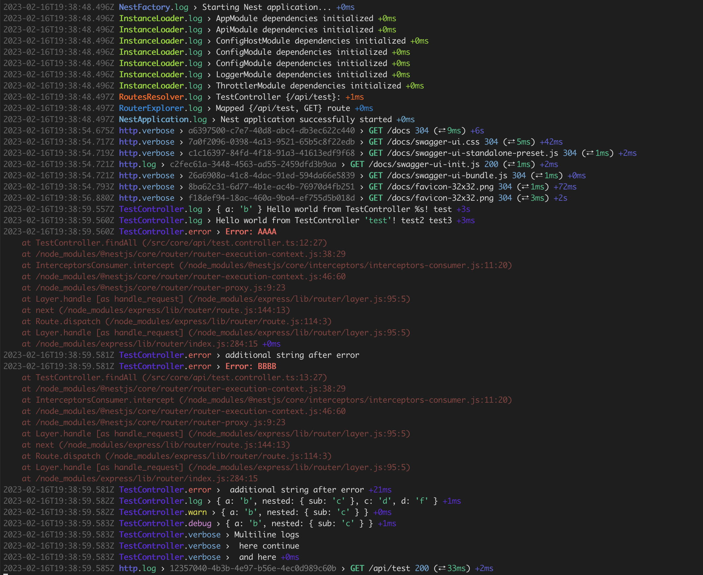

# Nestjs-Pino-Logger

## Motivation

The motivation of this package is to provide a pino logger for nestjs framework with near identical behaviour of the standard nestjs logger and to provide a good defaults for the logger. This also means that pino logger can be customized as needed without need to configure the Logger service, that makes the package flexible and lightweight. 

## Installation

```bash
npm install --save @zemd/nestjs-pino-logger
```

you also might need:
```bash
npm install --save @nestjs/common @nestjs/config pino pino-http
npm install --save-dev pino-pretty
```

## Usage

let's say you are defining AppModule:
```typescript
// app.module.ts
import { LoggerModule } from '@zemd/nestjs-pino-logger';
import {ConfigModule} from "@nestjs/config";
import pinoConfig from "./config/pino.config";
import pinoHttpConfig from "./config/pino-http.config";

@Module({
    imports: [
        ConfigModule.forRoot({
            isGlobal: true,
            load: [pinoConfig, pinoHttpConfig],
            // ... any other configuration options you want to use
        }),
        LoggerModule.forRootAsync({
            imports: [ConfigModule],
            useFactory: (configService: ConfigService) => configService.get<LoggerOptions>('pino'),
            inject: [ConfigService],
        }),
    ]
})
class AppModule {}
```

then you should inject `Logger` into your main app:

```typescript
// main.ts
import {Logger, PINO_LOGGER_INSTANCE} from '@zemd/nestjs-pino-logger';
import pinoHttp from "pino-http";
import type {Options} from 'pino-http';

const app = await NestFactory.create(AppModule, {bufferLogs: true});
app.useLogger(app.get(Logger));

// if you want to use pino-http ↓
app.use(pinoHttp({
  ...configService.get<Options>('pino-http'),
  logger: app.get(PINO_LOGGER_INSTANCE),
}));
```

now let's look closer at the `pino.config.ts` and `pino-http.config.ts` files:

```typescript
// pino.config.ts
import {registerAs} from "@nestjs/config";
import pino from "pino";
import {customLevels} from "@zemd/nestjs-pino-logger";

export default registerAs('pino', (): Partial<LoggerOptions> => {
    const targets: pino.TransportTargetOptions<Record<string, any>>[] = [];
    
    if (process.env.NODE_ENV !== "production") {
        // you don't need to use this transport in production, usually you would want to send logs as json object to the observability service
        targets.push({
            target: "@zemd/nestjs-pino-logger/dist/pino-pretty-transport.js", 
            level: process.env.NODE_ENV === "development" ? "verbose" : "error",
            options: {
                colorize: false,
                translateTime: true,
                include: '',
                singleLine: false,
                hideObject: true,
            },
        });
    }

    const transport = targets.length ? {targets} : undefined;

    return {
        customLevels,
        useOnlyCustomLevels: true, // this is required! and you should use this config explicitly to avoid any unexpected behaviour
        transport,
    };
});
```

that's basically it, if you want to use pino logger in your nestjs application, you can use any kind on configuration, but at the same time you can use default nestjs logger.

```typescript
// pino-http.config.ts
import {registerAs} from "@nestjs/config";
import {Options} from "pino-http";
import * as crypto from "node:crypto";

export default registerAs('pino-http', (): Partial<Options> => {
    return {
        level: process.env.LOG_LEVEL ?? "verbose",
        genReqId: (req, res) => {
            // this is not required 
            if (req.id) {
                return req.id;
            }
            return crypto.randomUUID();
        },
        customProps: () => ({
            // by default there is no "context" provided inside the middleware, so we need to add it manually
            context: 'http',
        }),
        // pino-http types don't accept custom log levels, so we need to use ts-ignore here,
        // if you want to use one log level for all requests, just use `useLevel` option.
        // @ts-ignore 
        customLogLevel: function (req, res, err) {
            if (res.statusCode >= 400 && res.statusCode < 500) {
                return 'warn'
            } else if (res.statusCode >= 500 || err) {
                return 'error'
            } else if (res.statusCode >= 300 && res.statusCode < 400) {
                return 'verbose'
            }
            return 'log'
        },
    };
});
```

## Advanced usage

### Extending message object

In case if you want extend pino log object by adding more fields, you can use `buildPinoMessage` helper function, that adds hidden `Symbol` to the object and which allows to distinguish between regular log message and custom.

It looks like:

```typescript
const message = buildPinoMessage({
  message: 'Hello World %o',
  mergingObject: { foo: 'bar' },
  interpolationValues: [{ data: 'the data object will be used to format the message' }]
});
this.logger.log(message, 'here you can also pass something that will be added to the msg string');
```

### Using request id

`nestjs-pino` package has exceptional feature that allows to leverage the request-id that you might noticed previously when we added `pino-http` middleware. Essentially this is great feature, but at the moment I don't think that it should be implemented within this package anytime in the future. It can be achieved by storing this info using `AsyncLocalStorage` inside the middleware function in `main.ts` file, and then retrieved in pino mixin. But in more complex scenario you should be using open telemetry, which can handle global trace-id and pass it with every log message. Also having request object in each log message would increase it's size and make it more expensive to transfer and store. 

Example of using open telemetry:
```typescript
// pino.config.ts
import { context, isSpanContextValid, trace } from '@opentelemetry/api';

//...registerAs...
return {
    // ... transfer
    // ... other pino options
    mixin: () => {
        const record = {};
        const span = trace.getSpan(context.active());
        if (span) {
            const spanContext = span.spanContext();

            if (isSpanContextValid(spanContext)) {
                Object.assign(record, {
                    trace_id: spanContext.traceId,
                    span_id: spanContext.spanId,
                    trace_flags: `0${spanContext.traceFlags.toString(16)}`,
                });
            }
        }

        return record;
    }
}
//...
```

`@opentelemetry/api` package also uses `AsyncLocalStorage` under the hood, so as you can see having control over the pino configuration can allow to achieve any kind of task.

## Example



## License

`@zemd/nestjs-pino-logger` released under the [LGPL-3.0 License](https://www.gnu.org/licenses/lgpl-3.0.html).

## Donate

[](https://www.patreon.com/red_rabbit)
[](https://u24.gov.ua/)
